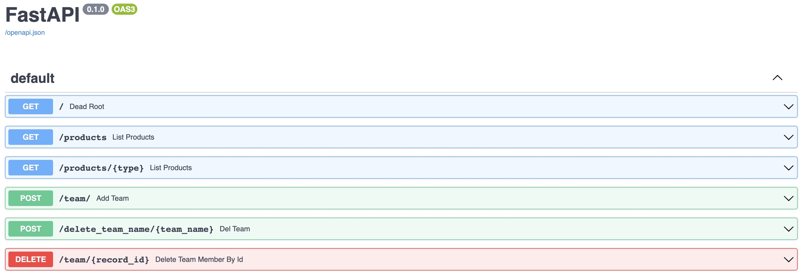

# Supermarket API Example 🚀

This is a personel project 🚀 to try pythonic code standarts and FastAPI 🐍

## Aim of the Project 🎯

There are tables stored on postgresql. We should communicate with db and run query for select, delete and insert upon API request.

## How to run? 🏃‍♀️

Please follow these steps:

**Running with Docker**

1. Clone this project to your local environment
2. Run `docker-compose build` on the terminal. Please be sure thayou should be in the same directory with docker-compose yaml.
3. Run `docker-compose up` on terminal again. 
4. Then, you can connect to swagger document of application vihttp://0.0.0.0:8000/docs

**Running on Terminal**

1. Clone this project to your local environment
2. Run `pip3 install .` on the same directory with pyproject.toml
3. Run `python3 -m uvicorn main:app --reload` on the samdirectory with ./src directory level.
4. Then, you can connect to swagger document of application vihttp://localhost:8000/doc

**Running unit tests**

1. Clone this project to your local environment
2. Run `python3 -m pytest ./tests/unit_tests.py` on terminal
3. You will see how many of them passed and failed in thefollowing screen.

## Postgres Environment 🐘

Postgresql server is running on Google Cloud and I have used 3 different table inside perishable_foods schema.  

These tables are product, product_category and teams tables. Information about these tables:

- teams: Includes information about teams in the supermarket and table is empty initially. We will insert data with api request and delete also.

| team_id   |  name  |  endpoint  |   api_key   |
| --------- | ------ | ---------- | ------------|

- product: Includes information about product category, name etc. The structure is like below.

| product_id    | product_category_id |         name         |       sell_by       |  lag |
| ------------- | ------------------- | -------------------- | ------------------- | ---- |
| 1             | 1                   | apples-red_7aa808a0  | 2023-02-23 10:08:04 | 600  |
| 2             | 2                   | bananas_79b8661c-c4  | 2023-02-23 10:08:04 | 600  |

- product_category: Includes informetion about categories of products.

|  product_category_id  |     name   |    restock_amount    |  restock_interval   |  expiry_time        |
| --------------------- | ---------- | -------------------- | ------------------- | ------------------- |
| 1                     | apples-red | 100                  | 600                 | 2024-02-23 10:08:04 |
| 2                     | bananas    | 150                  | 600                 | 2024-02-23 10:08:04 | 

### Swagger File (Endpoints) ✔️

